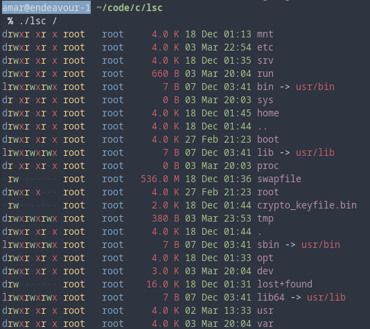

# lsc
Custom `ls` implementation with colors in C. Inspired by [Natls](https://github.com/willdoescode/nat)

## Preview


## Usage

### Print contents of current directory

```bash
$ ./lsc 
```

### Print contents of a given directory
```bash
$ ./lsc [directory_name]
```

### Print contents of multiple directories
```bash
$ ./lsc [directory_name_1] [directory_name_2]
```

